# 🏗️ Elevator Control System — A Distributed Real-Time Simulation

<div align="center">


**A production-grade elevator simulation implementing SCAN algorithms, AVL-tree optimized scheduling, and real-time state synchronization via WebSockets.**

*Designed for System Design Interview Prep | IoT Control Systems | Digital Twin Prototyping*

</div>

---

## 📸 Live Demonstrations

<table>
<tr>
<td align="center" width="50%">

### Single Elevator System


*FCFS, SSTF, LOOK, Elevator-LOOK algorithms with interrupt-driven re-prioritization*

</td>
<td align="center" width="50%">

### Multi-Elevator System


*Collective Control with dynamic request stealing and cost-minimization dispatch*

</td>
</tr>
</table>

---

## 🎯 Executive Summary

This monorepo contains two progressively complex implementations of vertical transportation control systems:

| System | Complexity | Core Algorithm | Concurrency Model | Use Case |
|:-------|:-----------|:---------------|:------------------|:---------|
| **Single-Elevator** | $O(n \log n)$ | SCAN/LOOK variants | Single async event loop | Small buildings, learning |
| **Multi-Elevator** | $O(k \cdot n \log n)$ | Collective Dispatch + Cost Function | Distributed agent cluster | Skyscrapers, production |

Both systems share a **common architectural DNA** — decoupled microservices communicating over WebSockets — but diverge significantly in their **scheduling heuristics**, **state management complexity**, and **fault tolerance strategies**.

> 💡 **Why Elevators?** The elevator scheduling problem is isomorphic to disk I/O scheduling (SCAN algorithm), job shop scheduling, and even ride-sharing dispatch (Uber/Lyft). Mastering this domain transfers directly to distributed systems interviews at FAANG.

---

## 🧬 Architectural DNA — Shared Infrastructure

Both implementations adhere to a **Hexagonal Architecture** (Ports & Adapters), ensuring the core domain logic remains agnostic to I/O concerns.

```
┌─────────────────────────────────────────────────────────────────────────────┐
│                           PRESENTATION LAYER                                │
│  ┌─────────────────────────────────────────────────────────────────────┐    │
│  │                     React 19 SPA + Zustand Store                    │    │
│  │         (Declarative UI, Optimistic Updates, Motion Animations)     │    │
│  └─────────────────────────────────────────────────────────────────────┘    │
│                                    │                                        │
│                    ┌───────────────┴───────────────┐                        │
│                    │     WebSocket (Push Stream)   │                        │
│                    │     REST API (Command/Query)  │                        │
│                    └───────────────┬───────────────┘                        │
├────────────────────────────────────┼────────────────────────────────────────┤
│                           APPLICATION LAYER                                 │
│  ┌─────────────────────────────────┴─────────────────────────────────┐      │
│  │                     FastAPI Gateway (ASGI)                        │      │
│  │           Pydantic Validation │ Dependency Injection │ CORS       │      │
│  └─────────────────────────────────┬─────────────────────────────────┘      │
│                                    │                                        │
├────────────────────────────────────┼────────────────────────────────────────┤
│                            DOMAIN LAYER                                     │
│  ┌─────────────────────────────────┴─────────────────────────────────┐      │
│  │              Elevator State Machine (Finite Automaton)            │      │
│  │    ┌─────────────┐    ┌─────────────┐    ┌─────────────────┐     │       │
│  │    │  IDLE State │◄──►│ MOVING State│◄──►│ DOOR_OPEN State │     │       │
│  │    └─────────────┘    └─────────────┘    └─────────────────┘     │       │
│  │                                                                   │      │
│  │    ┌─────────────────────────────────────────────────────────┐   │       │
│  │    │           AVL Tree (Self-Balancing BST)                 │   │       │
│  │    │    O(log n) Insert │ O(log n) Delete │ O(1) Min/Max     │   │       │
│  │    └─────────────────────────────────────────────────────────┘   │       │
│  └───────────────────────────────────────────────────────────────────┘      │
│                                                                             │
├─────────────────────────────────────────────────────────────────────────────┤
│                          INFRASTRUCTURE LAYER                               │
│  ┌──────────────────┐  ┌──────────────────┐  ┌────────────────────────┐     │
│  │ WebSocket Broker │  │  State Singleton │  │ Async Task Scheduler   │     │
│  │ (Connection Pool)│  │  (Thread-Safe)   │  │ (asyncio Event Loop)   │     │
│  └──────────────────┘  └──────────────────┘  └────────────────────────┘     │
└─────────────────────────────────────────────────────────────────────────────┘
```

### 🔧 Technology Stack Matrix

| Layer | Technology | Rationale |
|:------|:-----------|:----------|
| **Runtime** | Python 3.8+ (Backend), Node 18+ (Frontend) | Async-first ecosystems |
| **API Framework** | FastAPI + Uvicorn (ASGI) | Native `async/await`, OpenAPI auto-gen |
| **State Container** | Zustand (Client), Singleton Pattern (Server) | Minimal boilerplate, atomic updates |
| **Real-Time Protocol** | WebSocket (RFC 6455) | Full-duplex, <100ms latency |
| **Data Structures** | Custom AVL Tree | $O(\log n)$ guaranteed for stop queue ops |
| **Styling** | Tailwind CSS + Framer Motion | Utility-first, physics-based animations |
| **Type Safety** | TypeScript (strict mode) + Pydantic | Compile-time + runtime validation |
| **Build Tooling** | Vite (ESBuild) | Sub-second HMR, tree-shaking |

---

## 🔬 System I: Single-Elevator Controller

### Problem Statement

> Given a building with $N$ floors and a single elevator car, serve incoming hall calls and cabin requests while minimizing **Average Wait Time (AWT)** and **Total Travel Distance (TTD)**.

This is the **classical elevator scheduling problem**, directly analogous to the **Disk Arm Scheduling Problem** studied in Operating Systems.

### Implemented Scheduling Algorithms

| Algorithm | Strategy | Time Complexity | Starvation Risk | Use Case |
|:----------|:---------|:----------------|:----------------|:---------|
| **FCFS** | First-Come-First-Serve | $O(n)$ | None | Debugging, fairness-critical |
| **SSTF** | Shortest-Seek-Time-First | $O(n)$ per decision | **High** (edge floors) | Low-traffic buildings |
| **LOOK** | Directional sweep (no end travel) | $O(n \log n)$ | Low | Standard commercial |
| **Elevator-LOOK** | LOOK + interrupt handling | $O(n \log n)$ | **None** | Production systems |

### State Machine Transitions


### Interrupt-Driven Re-Prioritization

The single elevator(Elevator-LOOK Algorithm) implements a **preemptive interrupt system** that allows dynamic stop insertion without restarting the scheduling cycle:

### API Endpoints (Single)

| Method | Endpoint | Payload | Description |
|:-------|:---------|:--------|:------------|
| `POST` | `/api/request` | `{ floor: int, direction: U or D }` | Register hall call |
| `POST` | `/api/stop` | `{ floor: int }` | Register cabin button press |
| `GET` | `/api/status` | — | Snapshot of current elevator state |
| `WS` | `/ws` | — | Real-time state stream |

---

## 🔬 System II: Multi-Elevator Collective Control

### Problem Statement

> Given $K$ elevators serving $N$ floors, assign incoming requests to minimize **global Average Wait Time (AWT)** while balancing **load distribution** and **energy consumption**.

This is a **combinatorial optimization problem** with NP-hard characteristics. We employ **greedy heuristics** with **dynamic re-assignment** to achieve near-optimal solutions in polynomial time.

### The Collective Dispatch Algorithm

```mermaid
graph TD
    subgraph Request_Ingress["📥 Request Ingress"]
        HR["Hall Request (floor, direction)"]
    end

    subgraph Cost_Computation["🧮 Cost Computation Engine"]
        C0["Cost(E0) = f(distance, stops, direction)"]
        C1["Cost(E1) = f(distance, stops, direction)"]
        C2["Cost(E2) = f(distance, stops, direction)"]
    end

    subgraph Assignment["📋 Assignment Decision"]
        MIN["argmin(C0, C1, C2)"]
        ASSIGN["Assign to Winner"]
    end

    subgraph Reassignment["🔄 Dynamic Reassignment"]
        MONITOR["Monitor All Elevators"]
        STEAL["Steal Request if ΔC > threshold"]
    end

    HR --> C0
    HR --> C1
    HR --> C2
    C0 --> MIN
    C1 --> MIN
    C2 --> MIN
    MIN --> ASSIGN
    ASSIGN --> MONITOR
    MONITOR -->|"Every 2s"| STEAL
    STEAL -->|"Re-dispatch"| ASSIGN
```



### Cost Function Deep Dive

The dispatcher evaluates each elevator using a **weighted cost function**:

$$
C_i = \alpha \cdot D_i + \beta \cdot S_i + \gamma \cdot T_i
$$

Where:
- $D_i$ = **Distance Cost** = `|current_floor - target_floor| × travel_time_per_floor`
- $S_i$ = **Stops Penalty** = `num_intermediate_stops × avg_door_cycle_time` (typically 5s)
- $T_i$ = **Turn Penalty** = `requires_direction_change ? 30s : 0`

### Request Stealing Protocol

### Agent-Based Architecture

Each elevator operates as an **independent async agent** with its own event loop:

```
┌─────────────────────────────────────────────────────────────────────────┐
│                        DISPATCHER (Orchestrator)                        │
│   ┌─────────────────────────────────────────────────────────────────┐   │
│   │                    Global Request Queue                         │   │
│   │        (Thread-safe Priority Queue with Lock-Free Reads)        │   │
│   └───────────────────────────────┬─────────────────────────────────┘   │
│                                   │                                     │
│           ┌───────────────────────┼───────────────────────┐             │
│           │                       │                       │             │
│           ▼                       ▼                       ▼             │
│   ┌───────────────┐       ┌───────────────┐       ┌───────────────┐     │
│   │   AGENT E0    │       │   AGENT E1    │       │   AGENT E2    │     │
│   │ ┌───────────┐ │       │ ┌───────────┐ │       │ ┌───────────┐ │     │
│   │ │ Local AVL │ │       │ │ Local AVL │ │       │ │ Local AVL │ │     │
│   │ │   Tree    │ │       │ │   Tree    │ │       │ │   Tree    │ │     │
│   │ └───────────┘ │       │ └───────────┘ │       │ └───────────┘ │     │
│   │ ┌───────────┐ │       │ ┌───────────┐ │       │ ┌───────────┐ │     │
│   │ │  State    │ │       │ │  State    │ │       │ │  State    │ │     │
│   │ │  Machine  │ │       │ │  Machine  │ │       │ │  Machine  │ │     │
│   │ └───────────┘ │       │ └───────────┘ │       │ └───────────┘ │     │
│   │    async      │       │    async      │       │    async      │     │
│   │    run()      │       │    run()      │       │    run()      │     │
│   └───────┬───────┘       └───────┬───────┘       └───────┬───────┘     │
│           │                       │                       │             │
│           └───────────────────────┼───────────────────────┘             │
│                                   │                                     │
│                                   ▼                                     │
│   ┌─────────────────────────────────────────────────────────────────┐   │
│   │                   Global State Manager                          │   │
│   │         (Aggregates all agent states for broadcast)             │   │
│   └─────────────────────────────────────────────────────────────────┘   │
└─────────────────────────────────────────────────────────────────────────┘
```

---

## 🔀 Comparative Analysis: Single vs Multi

### Architectural Similarities

| Aspect | Implementation | Shared Code % |
|:-------|:---------------|:--------------|
| **State Machine** | Identical FSM (IDLE, MOVING, DOOR_OPEN) | ~90% |
| **AVL Tree** | Same self-balancing BST for stop queues | 100% |
| **WebSocket Protocol** | JSON payload structure, heartbeat mechanism | ~95% |
| **Frontend Components** | ElevatorShaft, FloorIndicator, ControlPanel | ~70% |
| **API Schema** | Pydantic models for request/response | ~80% |

### Algorithmic Differences

| Dimension | Single Elevator | Multi Elevator |
|:----------|:----------------|:---------------|
| **Scheduling Paradigm** | Local optimization (greedy) | Global optimization (cost function) |
| **Request Assignment** | Implicit (only one car) | Explicit dispatcher decision |
| **Direction Commitment** | Strict LOOK compliance | Soft commitment (can reassign) |
| **Queue Structure** | Single AVL tree | Per-elevator AVL + global pending queue |
| **Complexity per Request** | $O(\log n)$ | $O(k \cdot \log n)$ where $k$ = elevator count |
| **Failure Mode** | System halt | Graceful degradation (redistribute load) |

### State Synchronization

For Exact Payload, Refer Codebase
```
┌────────────────────────────────────────────────────────────────────────┐
│                    SINGLE ELEVATOR STATE PAYLOAD                       │
├────────────────────────────────────────────────────────────────────────┤
│  {                                                                     │
│    "current_floor": 5,                                                 │
│    "direction": "UP",                                                  │
│    "queue": [7, 9, 12],                                                │
│    "is_door_opem": False                                               │
│  }                                                                     │
└────────────────────────────────────────────────────────────────────────┘

┌────────────────────────────────────────────────────────────────────────┐
│                    MULTI ELEVATOR STATE PAYLOAD                        │
├────────────────────────────────────────────────────────────────────────┤
│  {                                                                     │
│    "total_floors": 8,                                                  │
│    "elevators": [                                                      │
│      {                                                                 │
│        "id": 0,                                                        │
│        "current_floor": 2.2,                                           │
│        "direction": "UP",                                              │
│        "requests": [5, 7]                                              │
│      }                                                                 │
│      {                                                                 │
│        "id": 1,                                                        │
│        "current_floor": 4.2,                                           │
│        "direction": "UP",                                              │
│        "requests": [1, 9]                                              │
│      }                                                                 │
│    ]                                                                   │
│  }                                                                     │
└────────────────────────────────────────────────────────────────────────┘
```

---

### 🚀 Quick Start Guide

- Clone Repo, Switch Branches, Run Individually Frontend/Backend in local.

---

## 🎓 Learning Outcomes

By studying and extending this project, you will gain proficiency in:

| Domain | Concepts |
|:-------|:---------|
| **Data Structures** | AVL Trees, Priority Queues, Hash Maps with TTL |
| **Algorithms** | SCAN/LOOK, Cost Functions, Greedy Heuristics |
| **Distributed Systems** | Actor Model, Work Stealing, Supervisor Pattern |
| **Real-Time Systems** | WebSockets, State Synchronization, Optimistic UI |
| **System Design** | Microservices, API Gateway, Event-Driven Architecture |
| **Concurrency** | async/await |

---

## 🔮 Future Roadmap

- [ ] **Destination Dispatch** — Pre-assign passengers to specific cars at the hall panel
- [ ] **Request Aging** — 
- [ ] **Weight Limit** — 

---


## 📝 License

This project is released for **educational purposes**. Feel free to fork, modify, and use as a reference for interviews, coursework, or personal learning.

---

<div align="center">

**Built with ⚡ by engineers, for engineers.**

*Star ⭐ this repo if it helped you crack that System Design interview!*

</div>
