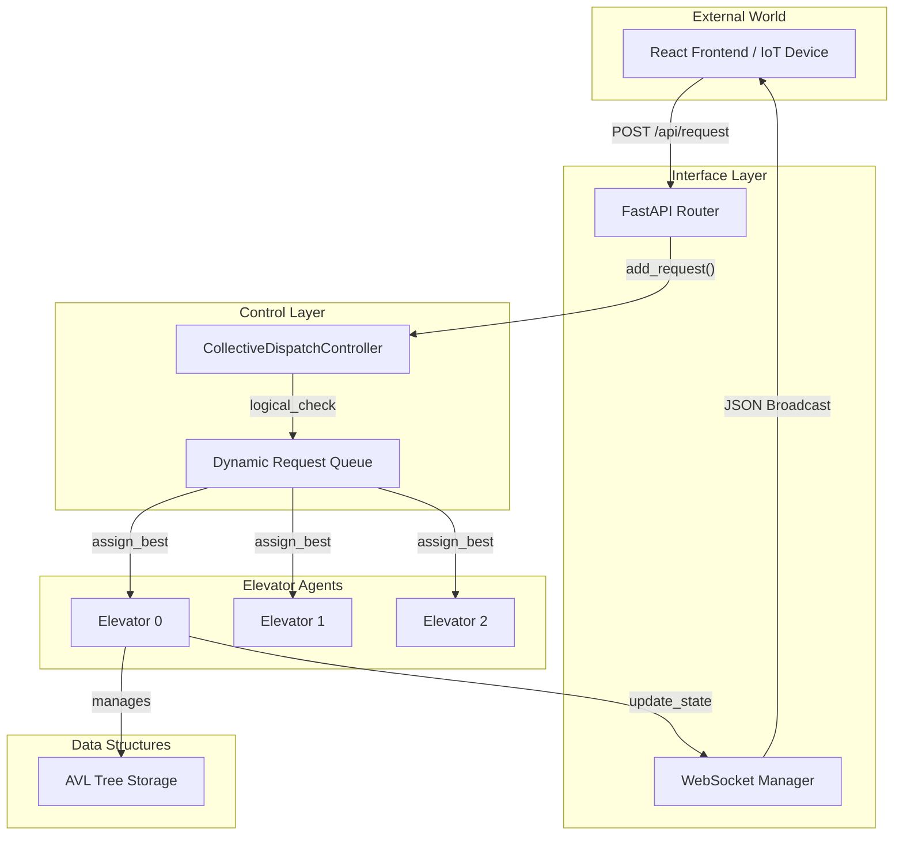

# 🏢 Multi-Elevator Control System - Backend Microservice

## 📖 Table of Contents
1. [Overview](#-overview)
2. [System Architecture](#-system-architecture)
3. [Core Logic & Algorithms](#-core-logic--algorithms)
   - [The Scheduler (AVL Trees)](#the-scheduler-avl-trees)
   - [Dispatch Algorithm (Cost Function)](#dispatch-algorithm-cost-function)
   - [State Machine Lifecycle](#state-machine-lifecycle)
4. [API Construction](#-api-construction)
   - [REST Endpoints](#rest-endpoints)
   - [WebSocket Protocol](#websocket-protocol)
5. [Folder Structure](#-folder-structure)
6. [Setup & Installation](#-setup--installation)

---

## 📖 Overview

The **Multi-Elevator Backend** is a high-concurrency, asynchronous control system designed to simulate and manage the complex logistics of vertical transportation. Built on top of **FastAPI** and **Python's Asyncio** event loop, it acts as the central brain for a multi-car elevator bank.

Unlike simple First-Come-First-Serve (FCFS) systems, this project implements a **Collective Control** strategy. It continuously calculates the "Cost" (time to arrival) for every request against every elevator, dynamically re-assigning requests if a better option appears due to changing conditions.

**Key Technical Capabilities:**
- **Non-blocking Concurrency:** Handles hundreds of simultaneous requests without thread blocking.
- **O(log N) Request Insertion:** Uses custom AVL Trees for sorted stop management.
- **Real-time State Broadcasting:** Pushes state changes to connected clients via WebSockets in milliseconds.
- **Fault Tolerance:** Robust interrupt handling ensures no request is lost even if an elevator changes direction mid-flight.

---

## 🏗 System Architecture

The system follows a Controller-Agent pattern. The `CollectiveDispatchController` is the orchestrator, while each `Elevator` is an autonomous agent that manages its own motion physics.



---

## 🧠 Core Logic & Algorithms

### The Scheduler (AVL Trees)
Standard arrays are inefficient for maintaining a sorted list of stops, especially when stops are constantly added and removed. We implemented a custom **AVL Tree (Self-Balancing Binary Search Tree)** for each direction of travel.

Each Elevator maintains **6 AVL Trees** to handle complex priorities:

1. **`internal_up` / `internal_down`**:
   - Stops requested by passengers *inside* the car.
   - **Priority:** Highest. Cannot be skipped.
   
2. **`up_up` / `down_down`** (Phase 1):
   - External requests that are "ahead" of the elevator in its current direction.
   - *Example:* Elevator at Floor 2 (UP) receives request for Floor 5 (UP).
   
3. **`up_down` / `down_up`** (Phase 2):
   - External requests that require a "turnaround".
   - *Example:* Elevator at Floor 2 (UP) receives request for Floor 5 (DOWN).
   - The elevator must go up to 5, open doors, and *then* switch direction to serve the DOWN request.

**Why AVL Trees?**
- **Insertion/Deletion:** O(log N)
- **Search:** O(log N)
- **Min/Max Finding:** O(log N) (Crucial for finding the next stop)

---

### Dispatch Algorithm (Cost Function)

The heart of the system is the `_get_best_elevator()` method. It evaluates the "Cost" (Time in seconds) for each elevator to service a specific request.

The cost formula `$C$` is derived as:

$$ C = (Distance \times T_{travel}) + (Stops \times T_{stop}) + T_{turnaround} $$

Where:
- `$T_{travel}$`: Time to cross one floor (5s).
- `$T_{stop}$`: Time lost stopping for existing passengers (5s).
- `$T_{turnaround}$`: Penalty for changing direction (30s).

**Scenario Analysis:**

| Scenario | Cost Calculation Logic |
| :--- | :--- |
| **Idle Elevator** | $Distance \times 5s$ |
| **En-route (Matching Dir)** | $(Dist \times 5s) + (ExistingStops \times 5s)$ |
| **En-route (Opposite Dir)** | $(Dist_{finish} \times 5s) + (Dist_{detect} \times 5s) + T_{turnaround}$ |

**Dynamic Re-Assignment:**
A background task `_run_dynamic_request_handler` runs every 0.5s. It checks if the currently assigned elevator is still the best choice.
- **Threshold:** If a new elevator can arrive **>5 seconds** faster than the current one, the request is "stolen" and re-assigned.
- **Lock-in:** If variable `elevator_cost <= 5s`, the request is "locked" and cannot be reassigned (elevator is arriving).

---

### State Machine Lifecycle

An elevator's lifecycle is a continuous loop rooted in `elevator_system.py`.

```text
       [ IDLE ]
          |
    (Request Received)
          |
          v
   [ DECIDE DIRECTION ]
          |
          v
+---- [ MOVING ] <-------+
|         |              |
|   (Floor Reached?)     |
|         | NO           |
|         v              |
|   (Wait 1s Travel) ----+
|         | YES
|         v
+---> [ ARRIVED ]
          |
    (Open Doors)
          |
    (Wait 5s)
          |
    (Close Doors)
          |
          v
   [ CHECK QUEUE ]
    /          \
(bi-dir pending) (Empty)
   |                |
   v                v
[ MOVING ]       [ IDLE ]
```

---

## 🔌 API Construction

### REST Endpoints

**1. General Info**
- `GET /`
  - Returns welcome message and available endpoints map.

**2. System Status**
- `GET /api/status`
  - **Returns:** JSON object containing the state of all elevators.
  ```json
  {
    "total_floors": 8,
    "elevators": [
      {
        "id": 0,
        "current_floor": 2.2,
        "direction": "UP",
        "requests": [5, 7]
      }
    ]
  }
  ```

**3. Requests**
- `POST /api/request` (Hall Call)
  - **Body:** `{"floor": 3, "direction": "UP"}`
  - **Logic:** Adds request to the dynamic queue for dispatching.
  
- `POST /api/stop` (Car Call)
  - **Body:** `{"elevator_id": 0, "floor": 5}`
  - **Logic:** Adds a high-priority internal stop to a specific elevator.

### WebSocket Protocol

**Endpoint:** `ws://localhost:8000/api/ws`

The server pushes updates automatically whenever a state change occurs (movement, door operation, new request). Clients do **not** need to poll.

**Payload Format:**
```json
{
  "type": "state_update",
  "timestamp": 1712345678.9,
  "elevators": [ ... ] 
}
```

---

## 📂 Folder Structure

```bash
backend/
├── elevator/
│   ├── avl_tree.py            # [ALGO] Balanced BST for request storage
│   ├── base_elevator.py       # [BASE] Abstract interface
│   ├── direction.py           # [ENUM] UP, DOWN, IDLE constants
│   ├── elevator_system.py     # [CORE] State machine & movement logic
│   ├── multi_elevator_system.py # [CTRL] Dispatcher & Cost function
│   ├── stop_scheduler.py      # [DATA] Wrapper around AVL trees
│   └── ui_state_manager.py    # [STATE] Clean state object for UI
├── helper/
│   ├── router.py              # [API] FastAPI routes definition
│   └── websocket_manager.py   # [NET] Connection pooling & broadcasting
├── main.py                    # [ENTRY] Server startup & lifespan config
└── tests/                     # [TEST] Integration scenarios
```

---

## ⚙️ Setup & Installation

### Prerequisites
- Python 3.10 or higher
- Pip (Python Package Manager)

### Installation Steps

1. **Clone the repository:**
   ```bash
   git clone <repo-url>
   cd multi-elevator-system/backend
   ```

2. **Create a Virtual Environment (Optional but Recommended):**
   ```bash
   python -m venv venv
   # Windows
   .\venv\Scripts\activate
   # Mac/Linux
   source venv/bin/activate
   ```

3. **Install Dependencies:**
   ```bash
   pip install fastapi uvicorn
   ```

4. **Run the Server:**
   ```bash
   python main.py
   ```

5. **Verify Running Status:**
   Open browser to `http://localhost:8000/docs` to see the Swagger UI documentation.

---

## ⚡ Performance Considerations

- **Async Sleep (`await asyncio.sleep`)**: We use non-blocking sleep to simulate travel time. This allows the main thread to process incoming API requests and recalculate costs *while* elevators are "moving".
- **Global Controller Singleton**: A single instance of `CollectiveDispatchController` is shared across all API routes, ensuring a unified state.
- **Throttled Broadcasting**: To prevent network congestion, WebSocket updates are only sent when the state *actually* changes (verified via hashing), rather than on every tick.
