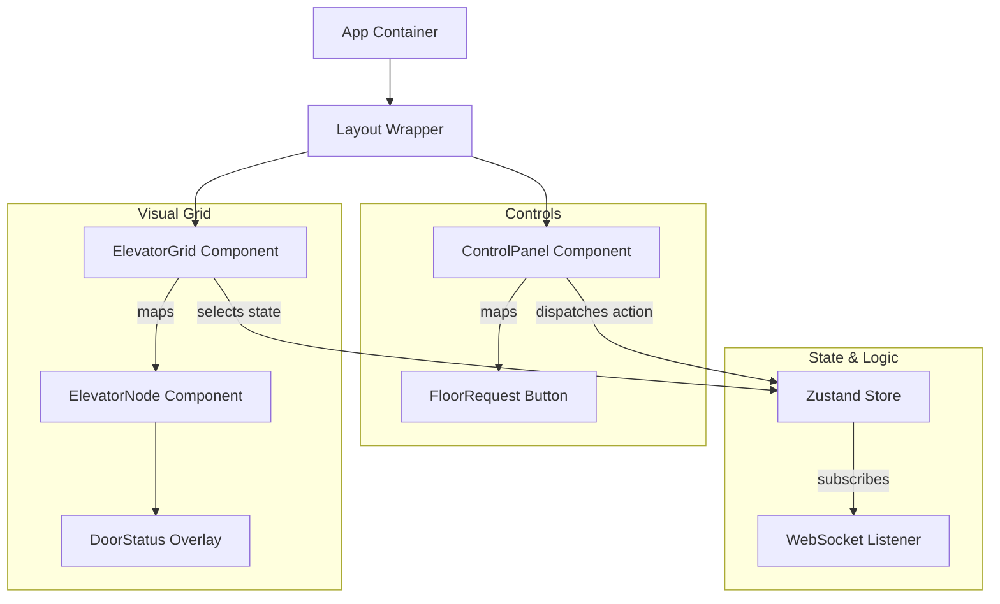
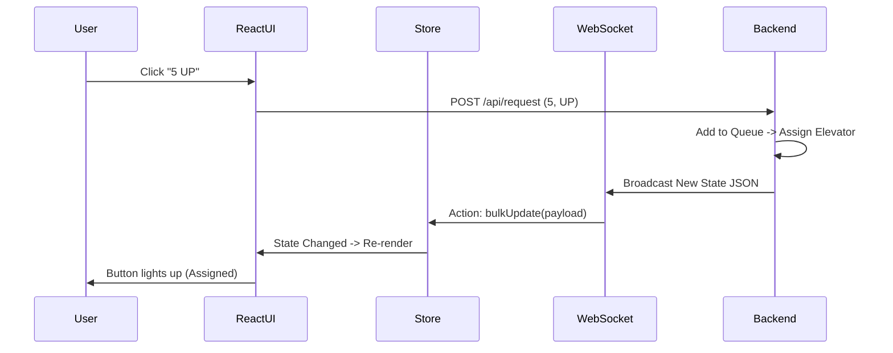

# 🖥️ Multi-Elevator System - Frontend Application

## 📖 Table of Contents
1. [Overview](#-overview)
2. [Architecture & Design](#-architecture--design)
   - [Component Hierarchy](#component-hierarchy)
   - [State Management (Zustand)](#state-management-zustand)
   - [WebSocket Integration](#websocket-integration)
3. [Visualizing the Logic](#-visualizing-the-logic)
4. [Folder Structure](#-folder-structure)
5. [Setup & Development](#-setup--development)

---

## 📖 Overview

The **Frontend Application** acts as the visual dashboard and control center for the elevator system. Because the backend is "headless" (pure API), this React application is crucial for observing the complex dispatch logic in real-time.

It provides immediate visual feedback on:
- **Elevator Position**: Smoothly interpolated movement between floors.
- **Door Status**: Visual cues for opening/closing/open states.
- **Request Status**: Illuminated buttons for active requests (both Hall and Car calls).
- **Direction Indicators**: Arrows showing planned movement.

**Key Technical Capabilities:**
- **Zero-Polling Updates**: Uses WebSockets for push-based state synchronization.
- **Optimized Re-renders**: Components only re-render when their specific data slice changes.
- **Responsive Animations**: Uses `Framer Motion` for fluid transitions, making the 500ms server ticks look like continuous movement.

---

## 🏗 Architecture & Design

### Component Hierarchy

The application is structured as a tree of presentation and container components.



**Component Breakdown:**
1.  **`src/App.tsx`**: Roots the provider context and initializes the global layout.
2.  **`src/components/ElevatorGrid.tsx`**: Renders the "shafts". It calculates the CSS height percentages based on the `current_floor` state (e.g., Floor 2.5 = 25% bottom offset).
3.  **`src/components/ElevatorNode.tsx`**: The actual car. It receives props like `door_open` and `direction` to render the SVG car icon and door animations.
4.  **`src/components/ControlPanel.tsx`**: A dashboard allowing the user to act as a "God Mode" operator, placing calls from any floor.

---

### State Management (Zustand)

We use **Zustand** over Redux/Context for its simplicity and performance in high-frequency update scenarios.

**Store Schema:**
```typescript
interface ElevatorState {
  // Static Configuration
  totalFloors: number;
  totalElevators: number;
  
  // Dynamic State
  elevators: ElevatorData[]; // Array of elevator objects
  
  // Actions
  setTotalFloors: (n: number) => void;
  updateElevator: (id: number, data: Partial<ElevatorData>) => void;
  bulkUpdate: (payload: any) => void; // Called by WebSocket
}
```

The `bulkUpdate` action is the most critical. When the backend pushes a generic state update, this reducer deeply merges the new data into the store, triggering React to re-render *only* the elevators that moved.

---

### WebSocket Integration

The Frontend maintains a persistent **full-duplex** connection to the backend.

**Connection Lifecycle:**
1.  **Connect**: On mount (`useEffect` in `App.tsx`), tries to connect to `ws://localhost:8000/api/ws`.
2.  **Listen**: Sets up an `onmessage` handler.
3.  **Parse & Dispatch**: When a message arrives:
    - Parse JSON.
    - Check type (`state_update`).
    - Dispatch `bulkUpdate` to Zustand store.
4.  **Reconnect**: If the connection drops (backend restart), it attempts auto-reconnection every 2 seconds.

**Sequence Diagram:**


---

## 📂 Folder Structure

```bash
frontend/
├── src/
│   ├── api/
│   │   ├── api.ts             # Axios setup (baseURL config)
│   │   └── endpoints.ts       # Centralized API URLs
│   ├── components/            
│   │   ├── ElevatorNode.tsx   # [UI] The car visualization
│   │   ├── FloorControl.tsx   # [UI] Hall call buttons
│   │   ├── Layout.tsx         # [UI] Page scaffold
│   │   └── StatusPanel.tsx    # [UI] Debug textual overlay
│   ├── hooks/
│   │   └── useWebSocket.ts    # [HOOK] Custom WS logic
│   ├── store/
│   │   └── useElevatorStore.ts # [STATE] Zustand definition
│   ├── types/
│   │   └── index.ts           # [TS] Shared interfaces
│   ├── App.tsx
│   └── main.tsx
├── public/                    # Static assets
├── index.html
├── tailwind.config.js
├── tsconfig.json
└── vite.config.ts
```

---

## ⚙️ Setup & Development

### Prerequisites
- Node.js 16+
- NPM or Yarn

### Installation

1.  **Clone the directory:**
    ```bash
    cd multi-elevator-system/frontend
    ```

2.  **Install dependencies:**
    ```bash
    npm install
    # or
    yarn
    ```

3.  **Configure Environment (Optional):**
    Create `.env` if you need to change the backend URL:
    ```env
    VITE_API_URL=http://localhost:8000
    VITE_WS_URL=ws://localhost:8000/api/ws
    ```

4.  **Run Development Server:**
    ```bash
    npm run dev
    ```
    Access at `http://localhost:5173`.

### Debugging Tips
- **Console Logs:** The WebSocket hook logs connection status changes.
- **React DevTools:** Use the "Components" tab to trace which components are re-rendering during elevator movement.
- **Network Tab:** Inspect `WS` filter to see the raw JSON frames coming from the backend.
